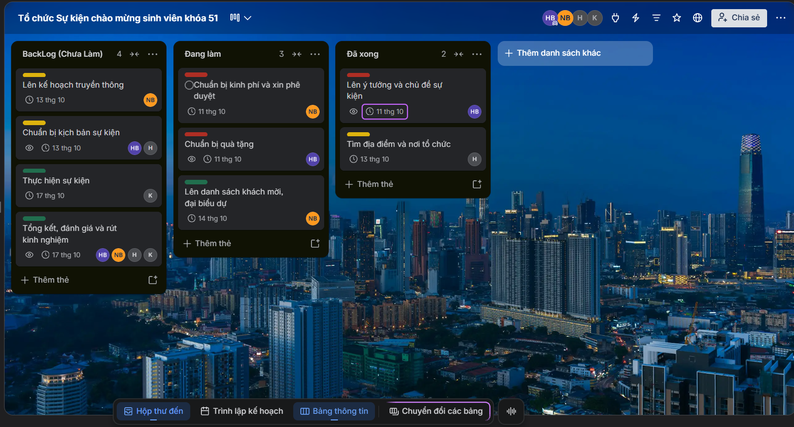

# ThucHanh07_Nhom04_D13_NenTangCNS
## Tên Bài Thực Hành: DỊCH VỤ TIỆN ÍCH VÀ SỬ DỤNG SÁNG TẠO
## Nội dung thực hành
**Bài 1: Khởi động nhanh đầu buổi, ứng dụng Google Docs các thành viên hợp tác trực tuyến**

**Link Google Docs:** [Tại đây](https://docs.google.com/document/d/1ws3_quicvSzwTg8x3MGz5l-ovBNed-hhS-W7XHreMF4/edit?tab=t.0)

**Bài 2: Tiện ích Google Form**

**Yêu Cầu**

  + **Google Form** để nhập thông tin sinh viên khóa 51: **[Tại đây](https://docs.google.com/forms/d/e/1FAIpQLSdyxr8X6Rpw69cYFI6PoxJxG74E-hhAxQMvzCdMIeE8wHVc_Q/viewform)**
  + **Google Form** để cho sinh viên khóa 51 đăng ký tối đa 80 sinh viên đi tham quan Công ty TMA ở HCM: **[Tại đây](https://docs.google.com/forms/d/e/1FAIpQLSfoYlK5OiYbDBgRnXfsSlIFx1BHHh7S6lCtXGdIe1UyBnIU4A/viewform)**

**Bài 3: Ứng dụng tiện ích Google Sites, yêu cầu sáng tạo, các thành viên hợp tác trực tuyến**
**Yêu Cầu**
  - Mỗi sinh viên trong nhóm tạo 1 web giới thiệu bản thân cá nhân mình dựa trên **Google Sites**
  - Sau đó xuất bản web.
  - Tạo 1 file word, lưu link web cá nhân đã xuất bản thành file: MSSV_web.docx.
  - Trưởng nhóm tạo 1 thư mục trên Google Drive, tổng hợp và nén thực mục, gửi GV
  - 
Link Google Drive: [Tại đây](https://drive.google.com/drive/folders/1uZ6R_JT9j6K5dOmCsdiJeS3AtD5C9rsv)

**Bài 4: Quản lý công việc, dùng Google Keep/Notionc**

Link Google Keep: [Tại đây](https://keep.google.com/share?tid=true#NOTE/1xTBc3M7hWAv09DV5AmXQ2e1U7emPpc7rW8Ah_fIBQd3mvKB9omHf5ESOXPbqQQ)

**Bài 5: Quản dự án dựa trên Trello**

**Yêu Cầu**
  - Thực hành quản lý dự án
  - Lên kế hoạch, phân công nhiệm vụ, theo dõi tiến độ và báo cáo trạng thái dự án.
  - Sử dụng Trello để trực quan hóa các công việc và tiến độ.

**Tiến độ**

**Link Trello:** [Tại đây](https://trello.com/invite/b/6ac656c06dfb5e7d9c76e998/ATTIf1f76d8efba8af64004edc7d130edda7EE940EE4/tổ-chức-sự-kiện-chao-mừng-sinh-vien-khoa-51)
